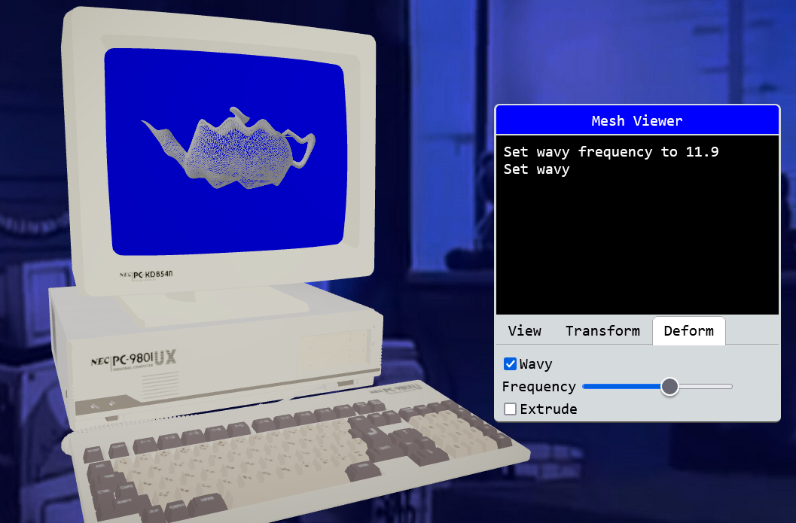

# mesh-viewer-demo
React three fiber (Three.js in React) demo 

[Live demo](https://lsand.dev/mesh-viewer-demo/) [Mirror](https://meshviewerdemo2-d3rqbuze3-turtles3s-projects.vercel.app/)

Known issues:
- Small square in the bottom-right of the screen mesh has incorrect UVs

